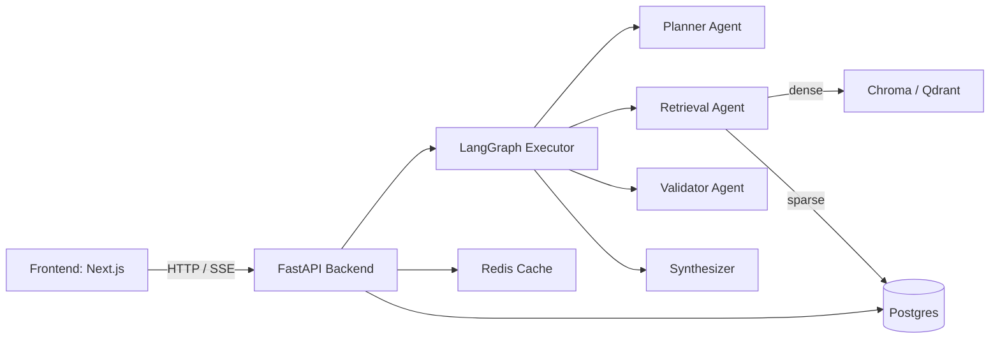

**System Architecture**

Architecture style: Agentic microservices-style monolith (single FastAPI backend with modular agents), layered into API → Agents → Services → Storage.

Design patterns:
- Agent pattern: planner produces JSON plans; agents implement responsibilities and are invoked by the LangGraph executor ([langgraph/executor.py](langgraph/executor.py#L1-L40)).
- Cache-aside with Redis for plans and retrieval results ([backend/app/agents/planner.py](backend/app/agents/planner.py#L1-L80)).
- Adapter pattern for vector backends (Chroma/Qdrant) in retrieval agent ([backend/app/agents/retrieval.py](backend/app/agents/retrieval.py#L1-L60)).

Layered Structure:
- Presentation: `frontend/` (Next.js) and streaming SSE endpoints in FastAPI.
- Application / Orchestration: `backend/app/main.py` + `langgraph/` runs plans.
- Agents: `backend/app/agents/*` provide retrieval, validation, synthesis, tools, memory.
- Services: `backend/app/services/*` provide document store, reranker, DB sessions, ingestion, rate-limiting.
- Data: PostgreSQL tables ([backend/app/models.py](backend/app/models.py#L1-L80)); optional vector DBs.

Service Boundaries & Responsibilities:
- `planner`: decomposes query, chooses retrieval strategy and whether validation is required.
- `retrieval`: hybrid retrieval (dense via vector store + sparse BM25), RRF fusion, reranking.
- `validator`: deterministic evidence checks and review gating.
- `synthesizer`: streams LLM tokens and enforces provenance/citation rules.
- `ingestion` services: handle document uploads, chunking, embedding and persistence.

Mermaid diagrams:

Overall Architecture:

Component Diagram and Layer Diagram: See above structure (service responsibilities traced to files in `backend/app/agents/` and `backend/app/services/`).
