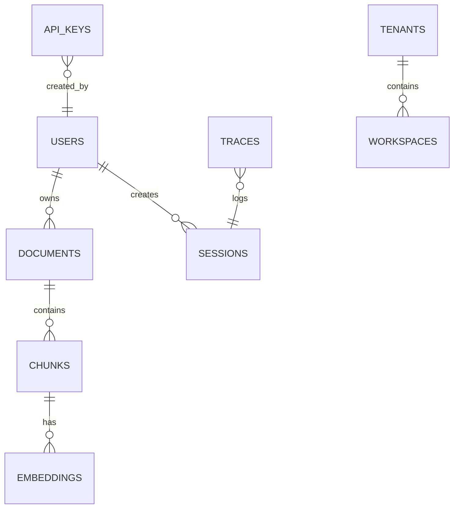

**Database Architecture**

Database technology: PostgreSQL (async via asyncpg + SQLAlchemy). Confirmed in [backend/app/services/db.py](backend/app/services/db.py#L1-L80).

Primary Tables (selected):
- `users`, `tenants`, `workspaces`, `roles`, `user_roles` — tenancy and RBAC.
- `documents`, `chunks`, `embeddings`, `ingestion_jobs`, `document_audits` — document ingestion and chunk storage.
- `sessions`, `traces`, `retrieval_logs`, `memories`, `review_requests`, `reflection_logs` — runtime traces, review workflows, and memory.
- `api_keys`, `audit_logs`, `tools_history` — keys and auditing.

Relationships & Constraints:
- `documents.owner_id` → `users.id`; `chunks.document_id` → `documents.id`; `embeddings.chunk_id` → `chunks.id`.
- Multi-tenancy via `tenant_id` and `workspace_id` on many tables.

Indexes: Not explicit in SQLAlchemy Table definitions — indexing is expected to be added in migrations (look under `backend/alembic/versions/`).

ER Diagram (high level):

Notes on audit & immutable trails:
- `document_audits` tracks actor, before/after snapshots per document change. `traces` stores orchestration traces which are persisted for later review.
