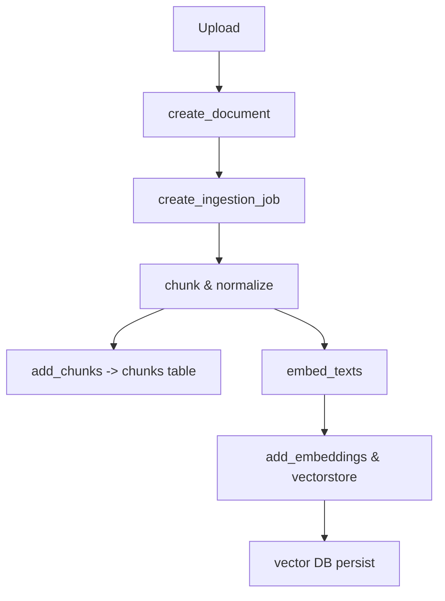

**Knowledge Ingestion Pipeline**

This project contains ingestion services that: accept uploaded documents, create ingestion jobs, chunk content, compute embeddings, and persist metadata and vectors.

Pipeline stages (as implemented across `backend/app/services/ingestion.py`, `document_store`, and `embeddings`):

- Document Upload: API endpoints for upload (see `backend/app/api/ingest.py` if present). Uploaded files are persisted and a `documents` row is created via `services.document_store.create_document`.
- Validation: Basic validation performed at API layer (file type/size) and job creation recorded in `ingestion_jobs`.
- Processing / Cleaning: Content extraction and normalization happens in the ingestion worker (Not Found in Codebase: explicit extraction pipeline code location — search `ingest` service for implementation).
- Chunking: Chunks are stored into `chunks` table via `services.document_store.add_chunks`.
- Metadata Extraction: Extracted metadata stored in `documents.metadata` and `chunks.metadata`.
- Embedding Generation: Embeddings computed via `app.embeddings.embed_texts` (sentence-transformers when enabled) or via external providers if configured.
- Vector Storage / Index Creation: Embeddings persisted in `embeddings` table and vector store (Chroma by default or Qdrant when configured). See [backend/app/agents/retrieval.py](backend/app/agents/retrieval.py#L1-L40) and [backend/app/clients/qdrant_client.py](backend/app/clients/qdrant_client.py#L1-L80).

Workflow diagram:

Notes & Gaps:
- Exact document parsing/extraction code locations are scattered or may be implemented in scripts under `scripts/` or `app/services/ingestion.py`. If missing, see `docs/MIGRATION_README.md` for hints.
