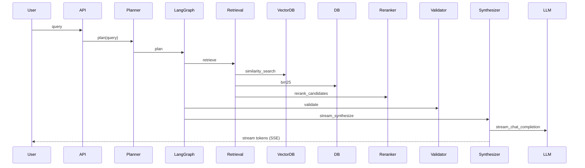

**RAG Pipeline Analysis**

Overview: The RAG pipeline is implemented primarily in the `retrieval`, `reranker`, `validator`, and `synthesizer` agents. The orchestration is controlled by `planner` and executed via LangGraph.

High-level flow:
- Query → Planner (decides steps and retrieval strategy)
- Retrieval (dense vector search + BM25 sparse) → RRF fusion → Reranker → Top-K chunks
- Validator checks evidence sufficiency and confidence → may set review gating
- Synthesizer constructs a prompt from retrieved chunks and streams from LLM

Chunking strategy: Chunks are stored in `chunks` table with `chunk_index`, `page_number`, `token_count` (when available). The chunking algorithm implementation point: ingestion worker (Not Found in Codebase: explicit chunker algorithm file name), but `chunks` schema exists in [backend/app/models.py](backend/app/models.py#L40-L90).

Embedding model: Default controlled by `EMBEDDING_MODEL` env; local sentence-transformers supported (`app/embeddings.py`).

Vector DB: Chroma by default via `langchain_community.vectorstores.Chroma`; optional Qdrant integration via `app/clients/qdrant_client.py` and retrieval logic in `app/agents/retrieval.py`.

Retrieval strategy: Hybrid dense + sparse. Dense via vectorstore similarity search; sparse via BM25 implemented in retrieval._bm25_retrieve. Fusion uses Reciprocal Rank Fusion (_rrf_fuse).

Reranking strategy: `services.reranker` uses a CrossEncoder (sentence-transformers) when enabled via env `ENABLE_RERANKER`, else heuristic scoring.

Context window & prompt construction: `synthesizer` builds a compact prompt that includes top retrieved excerpts and explicit instruction to answer ONLY based on provided excerpts. See [backend/app/agents/synthesizer.py](backend/app/agents/synthesizer.py#L1-L80).

Hallucination prevention:
- Validator computes `confidence` and `hallucination_risk` and can require human review when below threshold ([backend/app/agents/validator.py](backend/app/agents/validator.py#L1-L120)).
- Synthesizer instructs LLM to only use provided excerpts.

Answer Quality:
- See [21_ANSWER_GENERATION_QUALITY.md](21_ANSWER_GENERATION_QUALITY.md) for detailed standards on response style, content restrictions, and prompt injection handling.

Sequence Diagram:

