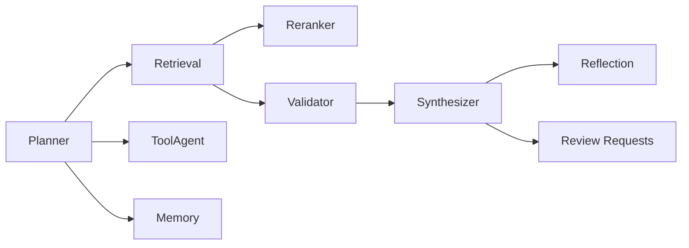

**Agent Architecture**

Agents are implemented under `backend/app/agents/`. The planner composes JSON plans and the LangGraph executor runs the steps.

Identified agents (files):
- `planner` ([backend/app/agents/planner.py](backend/app/agents/planner.py#L1-L80)) — decomposes queries into steps, uses a short LLM call for planning with caching in Redis.
- `retrieval` ([backend/app/agents/retrieval.py](backend/app/agents/retrieval.py#L1-L80)) — dense + sparse retrieval, fusion and reranking.
- `validator` ([backend/app/agents/validator.py](backend/app/agents/validator.py#L1-L80)) — deterministic evidence checks, confidence scoring, review gating.
- `synthesizer` ([backend/app/agents/synthesizer.py](backend/app/agents/synthesizer.py#L1-L80)) — streaming answer synthesis, reflection and revision.
- `tool_agent`, `memory`, `reflect` (references across `app/agents`): tool invocation and memory access hooks.

For each agent:
- Purpose: see file-specific docstrings; e.g., `retrieval` performs hybrid search and returns chunks with scores.
- Inputs: planner-produced plan, query, and user identity.
- Outputs: structured dicts used by downstream agents (e.g., `retrieval` returns `{chunks, strategy, timings, reranker}`).
- Available Tools: tools are implemented under `app/agents/tool_agent.py` (tool registry and execution) — each tool returns `{success, output}`.
- Memory Access: `memory` agent reads/writes `memories` table and may call `services.memory_store`.
- Decision Logic: planner uses a small LLM and deterministic fallback; validator uses deterministic heuristics to decide review gating.

Agent Interaction Diagram:

