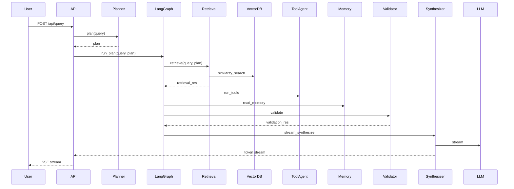

**Agent Workflows**

Typical user request flow (implemented in `backend/app/main.py` orchestrate → `langgraph.run_plan`):

1. User request arrives at `/api/query` or `/api/stream-query` ([backend/app/main.py](backend/app/main.py#L1-L140)).
2. `planner.plan(query)` produces a JSON plan (cached in Redis when available).
3. LangGraph executor runs the plan invoking agents in order (retrieval, tools, memory, validator, synthesizer).
4. Retrieval returns evidence chunks; validator evaluates sufficiency.
5. Synthesizer streams tokens back to client; if review required, a review request is created and persisted.

Detailed sequence diagram:

Human review path:
- If `validator` sets `review_required`, the orchestrator records a `review_request` row and the frontend surfaces the review queue for human approvers.
