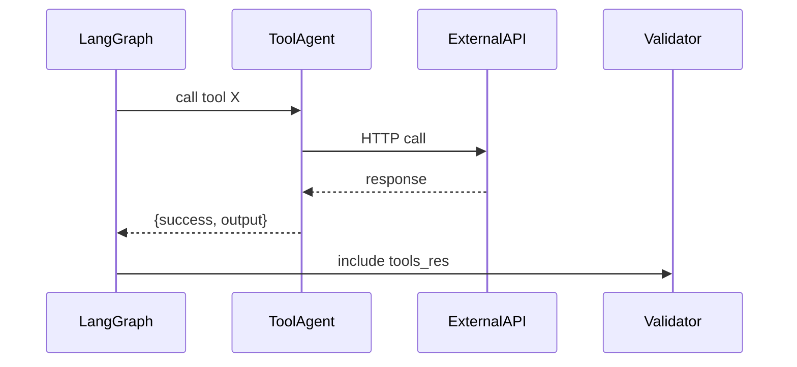

**Tool Calling Framework**

Available tools: Implemented under `backend/app/agents/tool_agent.py` and `app/services/*` (tools may include external API calls, enrichment, or domain-specific utilities).

Tool registry & selection:
- Tools are registered centrally; `planner` may include a `tools` step in the plan.
- `tool_agent` executes listed tools with input data and returns `{success, output, error}`.

Tool execution flow:
- Tool invocation happens inside LangGraph-run agent step; tool responses are captured and recorded in `tools_history` table.
- Tools may be executed with a timeout (configured in env e.g., `TOOLS_TASK_TIMEOUT`). See `backend/app/main.py` timeouts.

Error handling & retry:
- Tool failures are captured and fed to `validator` which may downgrade confidence.
- `retrieval` and other agents implement limited retries with exponential backoff for network ops.

Diagrams:

