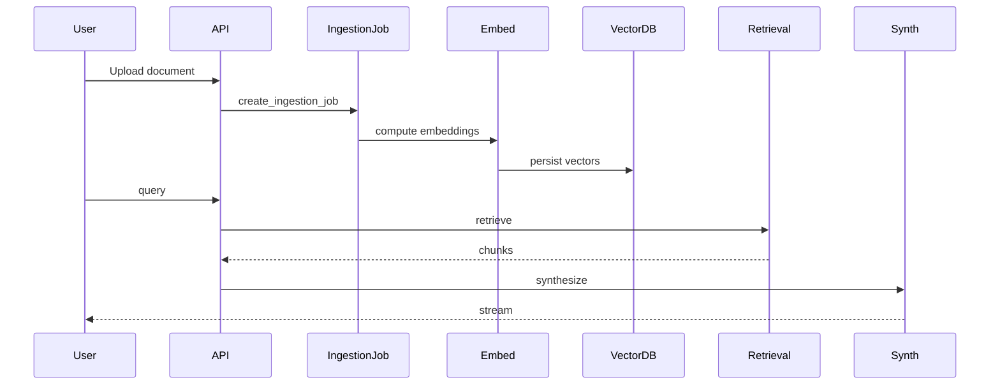

**Event Flow Analysis**

Key events and where they occur:
- Upload Event: occurs at ingestion endpoints; creates `ingestion_jobs` and `documents` entries.
- Embedding Event: ingestion worker or embedding service calls `embed_texts` and persists `embeddings` rows and vector DB entries.
- Retrieval Event: triggered by query orchestration; retrieval logs persisted to `retrieval_logs` and cache keys in Redis.
- Agent Event: agent start/complete logged via `traces` and observability hooks.
- Review Event: review requests created in `review_requests` and updated by human reviewers.
- Notification Event: Not Found in Codebase: explicit notification (email/Slack) dispatchers.

Event diagram example:

