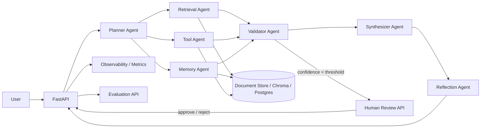
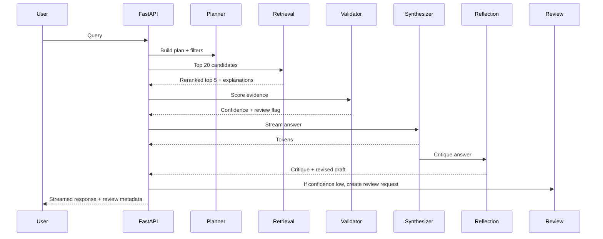
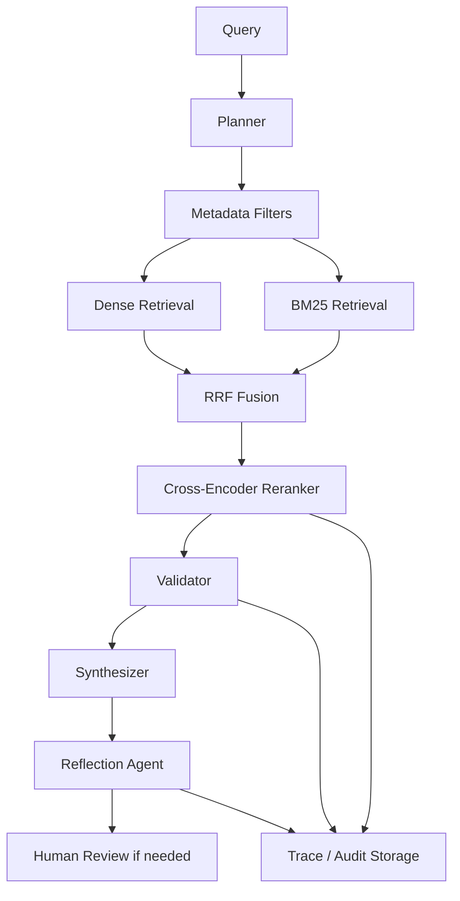
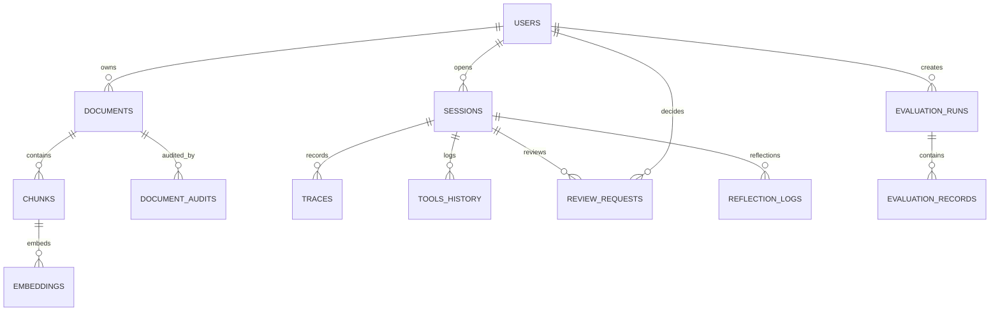
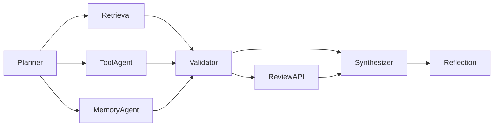

# Architecture Review

## Updated Architecture Diagram

## Sequence Diagram

## Data Flow Diagram

## Database ER Diagram

## Agent Communication Diagram

## Notes

The upgraded design keeps the original agent workflow intact while adding:

1. Metadata filtering before reranking.
2. Cross-encoder reranking with latency and explanation outputs.
3. Human-in-the-loop review when validator confidence is low.
4. Memory scoring for short-term and semantic recall.
5. Evaluation persistence for RAGAS-style and DeepEval-style metrics.
6. Reflection logging for post-synthesis quality control.
7. Tool registry governance and tool audit trails.
